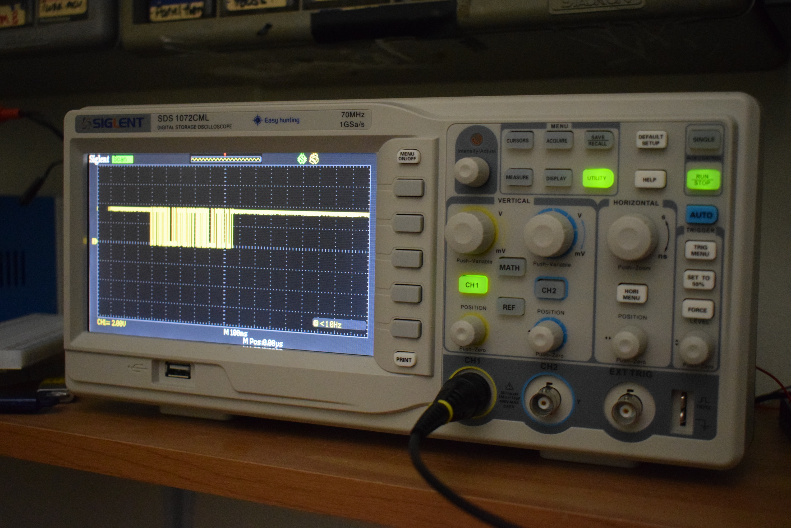

# FTDI (USB/USART/etc) Programming

#### Resources
* [FT232R](http://www.ftdichip.com/Products/ICs/FT232R.htm) (USB<->USART)
* [FT232H](http://www.ftdichip.com/Products/ICs/FT232R.htm) (USB<->USART/SPI/I2C/etc)
* [FTDI API Programmer's Guide](
http://www.ftdichip.com/Support/Documents/ProgramGuides/D2XX_Programmer's_Guide(FT_000071).pdf)

#### Concepts
* every FTDI command returns a status code. I always capture it as "ft_status" and only check it when I'm interested. Good programmers will check it every time to ensure the program doesn't crash between FTDI calls.

## Quickstart (console application)
```cs
using System;
using System.Collections.Generic;
using System.Linq;
using System.Text;
using System.Threading.Tasks;

using FTD2XX_NET; // installed with NuGet

namespace LearnFTDI3
{
    class Program
    {
        public static FTDI ftdi = new FTDI();
        public static FTDI.FT_STATUS ft_status = FTDI.FT_STATUS.FT_OK;

        static void Main(string[] args)
        {
            ft_status = ftdi.OpenByIndex(0);
            ft_status = ftdi.SetBaudRate(300);
            UInt32 bytesWritten = 0;
            string data = "some awesome text";
            ft_status = ftdi.Write(data, data.Length, ref bytesWritten);
            ft_status = ftdi.Close();
            Console.WriteLine($"DONE ({ft_status})");
        }
    }
}

```



## Quickstart (fancier)
```cs
FTDI ftdi = new FTDI();
FTDI.FT_STATUS ft_status = FTDI.FT_STATUS.FT_OK;
        
// this function looks up details about every FTDI device
void Scan_ftdi_devices()
{
    // start by resetting things (needed?)
    ftdi.ResetPort();

    // determine how many FTDI devices are there
    uint nDevices = 0;
    ft_status = ftdi.GetNumberOfDevices(ref nDevices);

    // get details for all devices
    FTDI.FT_DEVICE_INFO_NODE[] ftdiDeviceList = new FTDI.FT_DEVICE_INFO_NODE[nDevices];
    ft_status = ftdi.GetDeviceList(ftdiDeviceList);

    // show info for each device
    string msg = "";
    for (int i = 0; i < nDevices; i++)
    {
        msg += string.Format($"Device Number: {i}");
        msg += string.Format($"\nDescription: {ftdiDeviceList[i].Description}");
        msg += string.Format($"\nFlags: {ftdiDeviceList[i].Flags}");
        msg += string.Format($"\nftHandle: {ftdiDeviceList[i].ftHandle}");
        msg += string.Format($"\nID: {ftdiDeviceList[i].ID}");
        msg += string.Format($"\nLocId: {ftdiDeviceList[i].LocId}");
        msg += string.Format($"\nSerialNumber: {ftdiDeviceList[i].SerialNumber}");
        msg += string.Format($"\nType: {ftdiDeviceList[i].Type}");
        msg += "\n\n";
    }
    
    richTextBox1.Text = msg;
}

```

## Sending Data
```cs
void Send_serial_data(string serialNumber)
{
    ftdi.OpenBySerialNumber(serialNumber);

    if (ft_status != FTDI.FT_STATUS.FT_OK)
    {
        MessageBox.Show("FTDI status is not OK", "ERROR!!!");
        return;
    }

    ftdi.SetBaudRate(9600);
    ftdi.SetDataCharacteristics(
        FTDI.FT_DATA_BITS.FT_BITS_8, 
        FTDI.FT_STOP_BITS.FT_STOP_BITS_1, 
        FTDI.FT_PARITY.FT_PARITY_NONE
        );
    ftdi.SetTimeouts(2000, 0); // 2 second timeout

    UInt32 bytesWritten = 0;
    byte[] data = new byte[] { 1, 3, 7, 13, 21 };
    ft_status = ftdi.Write(data, data.Length, ref bytesWritten);
    ft_status = ftdi.Close();
    Console.WriteLine(ft_status);
}
```
