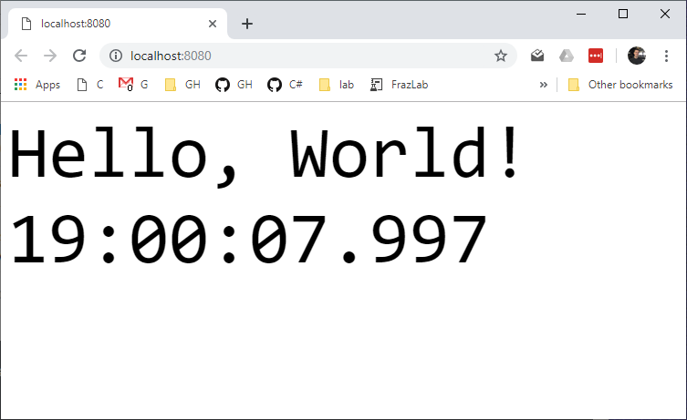

# Simpler C# Web Server

This page demonstrates simple code to serve dynamically-generated web pages on localhost (127.0.0.1) port 8080. This code was created by refactoring David's [simple C# web server](https://codehosting.net/blog/BlogEngine/post/Simple-C-Web-Server) to improve readability, resulting in a _simpler_ C# web server ready for modification. I also added basic logging and exception handling features.

## Screenshot


## Usage
Put this code in your Windows Forms or Console Application.
```cs
public void ServerStart(bool launchToo = true)
{
    webServer = new WebServer("http://localhost:8080/", RequestHandler);
    if (launchToo)
        System.Diagnostics.Process.Start(webServer.url);
}
```

```cs
public void ServerStop()
{
    webServer.Stop();
}
```

```cs
public static string RequestHandler(HttpListenerRequest request)
{
    string timestamp = DateTime.Now.ToString("HH':'mm':'ss.fff");
    string html = $@"
        <html>
        <head>
            <meta http-equiv='refresh' content='.25'> <!-- auto-refresh -->
        </head>
        <body>
            <div style='font-size: 5em; font-family: consolas;'>
            Hello, World!<br>{timestamp}
            </div>
        </body>
        </html>".Trim();
    return html;
}
```

### WebServer.cs
```cs
using System;
using System.Net;
using System.Threading;
using System.Linq;
using System.Text;
using System.Diagnostics;

namespace YOUR_NAMESPACE_HERE
{
    // modified from https://codehosting.net/blog/BlogEngine/post/Simple-C-Web-Server
    public class WebServer
    {
        private readonly HttpListener listener = new HttpListener();
        private readonly Func<HttpListenerRequest, string> requestHandler;
        public readonly string url;

        public WebServer(string url, Func<HttpListenerRequest, string> requestHandler)
        {
            this.url = url;
            this.requestHandler = requestHandler;
            Start();
        }

        public void Start()
        {
            listener.Prefixes.Clear();
            listener.Prefixes.Add(url);
            listener.Start();
            WaitCallback workItemServeForever = new WaitCallback(ListenForever);
            ThreadPool.QueueUserWorkItem(workItemServeForever);
            Log($"WebServer is listening for requests on {url}");
        }

        public void Stop()
        {
            listener.Abort();
            Thread.Sleep(50);
            listener.Close();
            Log($"WebServer stopped listening to requests on: {url}");
        }

        private void ListenForever(Object stateInfo)
        {
            try
            {
                while (listener.IsListening)
                    ThreadPool.QueueUserWorkItem(new WaitCallback(HandleContext), listener.GetContext());
            }
            catch (Exception exception)
            {
                Log(exception);
            }
        }

        private void HandleContext(Object receivedContext)
        {
            HttpListenerContext context = (HttpListenerContext)receivedContext;
            Log($"{context.Request.HttpMethod} {context.Request.Url.PathAndQuery}");
            try
            {
                byte[] buffer = Encoding.UTF8.GetBytes(requestHandler(context.Request));
                context.Response.ContentLength64 = buffer.Length;
                context.Response.OutputStream.Write(buffer, 0, buffer.Length);
            }
            catch (Exception exception)
            {
                Log(exception);
            }
            finally
            {
                context.Response.OutputStream.Close();
            }
        }

        public void Log(string message)
        {
            string timestamp = DateTime.Now.ToString("yyyy'-'MM'-'dd' 'HH':'mm':'ss.fff");
            Console.WriteLine($"WebServer [{timestamp}] {message}");
        }
        
        public void Log(Exception exception)
        {
            if (exception.Message.Contains("thread exit or an application request"))
            {
                Log("WebServer thread has ended (exception caught)");
            }
            else
            {
                StackTrace trace = new StackTrace();
                int callerIndex = 1;
                StackFrame frame = trace.GetFrame(callerIndex);
                string callerName = frame.GetMethod().Name;
                Log($"EXCEPTION thrown by {callerName}:\n   {exception.ToString()}");
            }
        }
    }
}
```
